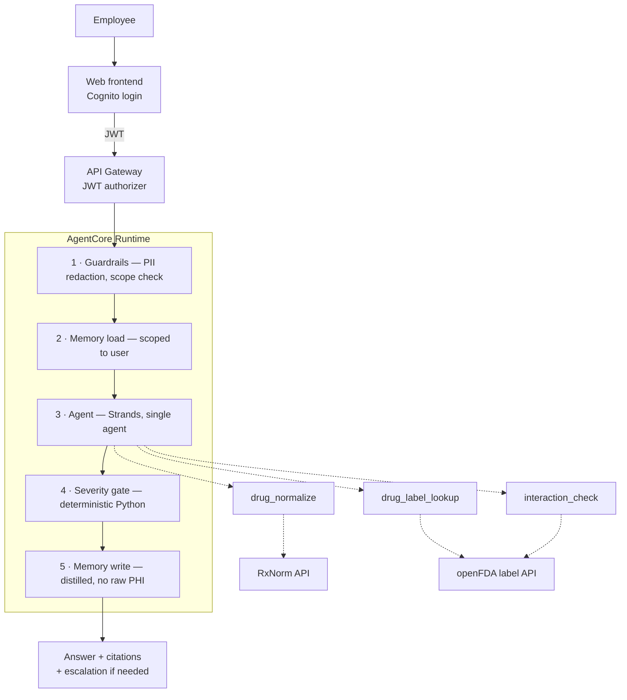

# PharmaAgent — Internal Health Assistant

An AI health assistant for employees, built on **Amazon Bedrock AgentCore**.

Staff ask questions about medications in plain language and get answers grounded in
official FDA drug labelling — with citations, and with a deterministic safety gate
that escalates anything clinically serious to a real clinician.

> **Not a medical device and not a substitute for professional care.**
> Informational support only. Every medium-or-higher severity response directs the
> user to qualified medical advice.

---

## Status

| | |
|---|---|
| Phase | **v1 — in development** |
| Branch | `feat/v1-health-assistant` |
| Region | `ap-south-1` |
| Runtime | AgentCore Runtime (CodeZip, Python) |

## Scope

**v1 — in progress**
- Drug information: what a drug is, indications, dosage, class
- Drug–drug interactions, grounded in both products' labels
- Toxicity: boxed warnings, contraindications, overdose information
- Cognito authentication, per-user conversation memory
- Severity triage with escalation to professional advice

**v2 — planned.** Symptom and condition Q&A. Needs a different grounding corpus
(drug labels do not describe conditions) and introduces vector retrieval.

**v3 — deferred.** Lab report interpretation.

---

## How it works



Full detail in [`docs/architecture.md`](docs/architecture.md) and
[`docs/dataflow.md`](docs/dataflow.md).

---

## Data sources

Both are free, public, US-government-operated, and require no API key for
development volumes.

| Source | Used for | Endpoint |
|---|---|---|
| **RxNorm** (NIH/NLM) | Name normalisation — brand→generic, misspellings, ingredient→product IDs | `rxnav.nlm.nih.gov/REST` |
| **openFDA** (FDA) | Drug label text — the actual grounding content | `api.fda.gov/drug/label.json` |

### Why not the RxNav interaction API

It was retired. Verified:

```
GET https://rxnav.nlm.nih.gov/REST/interaction/interaction.json?rxcui=11289
→ HTTP 404 Not found
```

There is no free structured drug-interaction database. Interactions are therefore
derived from **label text in both directions** — see
[`docs/architecture.md`](docs/architecture.md#interaction-checking).

### The rxcui join

RxNorm returns *ingredient*-level concept IDs. openFDA labels carry *product*-level
ones. They do not match, and joining them naively returns zero results for every
drug — a silent total failure.

```
warfarin → RxNorm ingredient rxcui        11289
           openfda.rxcui:11289            → NO MATCH
           /rxcui/11289/related.json?tty=SCD
                                          → 855288, 855296, 855302 …
           openfda.rxcui:855288           → MATCH
```

Always resolve ingredient → SCD products before querying openFDA.

---

## Safety model

Safety is enforced in **deterministic Python**, never by prompt instruction alone.
A prompt that says "be careful" fails silently and unmeasurably; code that returns a
typed flag fails loudly and is unit-testable.

| Control | Where | Why there |
|---|---|---|
| PII/PHI redaction | Bedrock Guardrails, input | Before model or memory sees it |
| Emergency keyword tripwire | Python, pre-model | Must fire even if the model misclassifies |
| Severity classification | Model output, typed enum | Structured, therefore testable |
| Escalation block | Python, post-model | Appended by code, not left to the prompt |
| "Not documented ≠ safe" | Python, post-tool | The single most dangerous confusion in this domain |
| No prompt text in logs | Logging layer | Health questions must not land in CloudWatch |

### Handling of personal data

- Prompts are **never** written to logs. Logs carry event IDs, intents, latencies, metrics.
- Memory is scoped per user (Cognito `sub`) with a bounded TTL.
- Memory stores **distilled context**, not raw message text.
- No organisation-wide view of individual users' questions exists, by design.

---

## Repository layout

```
pharmaagent/
├── agentcore/              AWS configuration and infrastructure
│   ├── agentcore.json      Declarative resource spec — source of truth
│   ├── aws-targets.json    Deployment target (account + region)
│   └── cdk/                CDK stack (@aws/agentcore-cdk L3 constructs)
├── app/drugagent/          Agent application code
├── docs/                   Architecture, dataflow, implementation plan
└── frontend/               React client (v1, not yet built)
```

`agentcore/*.json` is the source of truth. Do not change agent behaviour by editing
generated CDK code. See [`AGENTS.md`](AGENTS.md).

---

## Development

Prerequisites: Node.js 20+, Python 3.10+, [uv](https://docs.astral.sh/uv/), AWS credentials.

```bash
agentcore dev       # run locally with hot reload
agentcore invoke    # send a test request
agentcore validate  # check configuration
agentcore deploy    # deploy to AWS
agentcore logs      # view logs
agentcore traces    # view traces
```

## Observability

OpenTelemetry spans and metrics, plus CloudWatch metrics, at every layer — request,
agent, tool, and upstream API. A CloudWatch dashboard is defined in
`agentcore/cdk/lib/observability-dashboard.ts`.

## Documentation

- [Architecture and design decisions](docs/architecture.md)
- [Data flow](docs/dataflow.md)
- [Implementation plan](docs/implementation-plan.md)
- [AgentCore project conventions](AGENTS.md)
