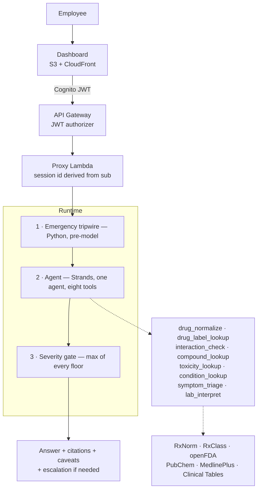

# PharmaAgent — Internal Health Assistant

An AI health assistant for employees, built on **Amazon Bedrock AgentCore**.

Staff ask about medicines, conditions, symptoms, drug interactions, toxicity and
lab results in plain language. Answers are grounded in official sources with
citations, and a deterministic safety gate escalates anything clinically serious
to a real clinician.

> **Not a medical device and not a substitute for professional care.**
> Informational support only. Every medium-or-higher severity response directs
> the user to qualified medical advice.

---

## Status

| | |
|---|---|
| Phase | Prototype — chat flows working end to end |
| Branch | `feat/v1-health-assistant` |
| Region | `ap-south-1` |
| Runtime | AgentCore Runtime (CodeZip, Python 3.14) |
| Model | `apac.amazon.nova-lite-v1:0` — APAC-scoped inference profile |
| Tests | 184 unit (no network, <1s) + 11 live smoke |
| Guardrail | `4xo8hb0f7iyl` v2 — 5 denied topics, input-only |

**Working now:** deployed to AgentCore Runtime with the guardrail attached. All
eight tools, emergency tripwire, severity gate, citations, Indian brand
resolution, lab interpretation by pasted text, and a dashboard that calls the
deployed runtime.

**Not built yet:** AgentCore Memory, lab report file upload (PDF/photo), online
evaluators. See [`docs/implementation-plan.md`](docs/implementation-plan.md).

---

## Run it

```bash
# 1. set your org email domain
#    agentcore/cdk/cdk.json → context.allowedEmailDomains

# 2. deploy everything
agentcore deploy

# 3. point the page at the stack it talks to
scripts/write-frontend-config.sh
```

Employees sign in with their work email through Cognito. The browser never holds
AWS credentials — see [`agentcore/cdk/AUTH.md`](agentcore/cdk/AUTH.md).

The unit tests (`cd app/drugagent && uv run pytest -m "not smoke"`) need neither
credentials nor network.

---

## How it works



Full detail in [`docs/architecture.md`](docs/architecture.md) and
[`docs/dataflow.md`](docs/dataflow.md).

---

## The design rule

**Guarantees live in code, not in prompts.**

Anything that must be true — escalation fires, "no interaction documented" never
reads as "safe", a lab value is flagged by arithmetic — is enforced in Python and
covered by a test. The model writes language; it does not enforce policy.

`app/drugagent/domain/` holds those rules. It imports no client, no model and no
AWS SDK, so every guarantee is provable without credentials or a network, and the
whole unit suite runs in under a second.

Seventeen decisions with their rejected alternatives are recorded in
[`docs/architecture.md`](docs/architecture.md) §4.

---

## Data sources

All public, free, no API key at development volumes.

| Source | Used for |
|---|---|
| **RxNorm** | Name normalisation — brand→generic, misspellings, ingredient→product IDs |
| **RxClass** | ATC drug classes — a label warns about "NSAIDs" and never says "ibuprofen" |
| **openFDA** `/drug/label` | Prescribing information — the grounding content |
| **openFDA** `/drug/event` | FAERS adverse event reports — counts, never rates |
| **PubChem** | Compound chemistry and GHS hazard classification |
| **MedlinePlus** | Conditions in consumer language; lab tests by LOINC code |
| **NLM Clinical Tables** | Analyte name → LOINC code |

Each was probed with positive, negative and **nonsense** controls before any
client was written against it. `app/drugagent/probes/FINDINGS.md` records what
each returned — including six different ways of saying "nothing found", and the
traps that follow from them.

### Why not the RxNav interaction API

Retired. Verified live, not from memory:

```
GET https://rxnav.nlm.nih.gov/REST/interaction/interaction.json?rxcui=11289
→ HTTP 404 Not found
```

No free structured drug-interaction database exists, so interactions are derived
by cross-checking both products' label text in both directions — see
[`docs/architecture.md`](docs/architecture.md) §5.

### Why every answer names a country

Every source above is American; the users are in India. A US label presented as
though it described the tablet in someone's hand is a citation that does not
support its claim. Indian brand names are resolved locally
(`domain/brands.py`), and the jurisdiction is stated in the answer — decision D14.

---

## Before real users

- **Clinical review** of the emergency tripwires (`domain/severity.py`), the
  triage ruleset (`domain/triage.py`), `CRITICAL_RANGE_MULTIPLE`
  (`domain/labs.py`) and the brand map (`domain/brands.py`). All four are plain
  readable rules, deliberately, so a clinician can check them.
- Organisational sign-off on accepting employee health data.
- Invite the first users: `aws cognito-idp admin-create-user` (the pool is
  admin-invite only).
