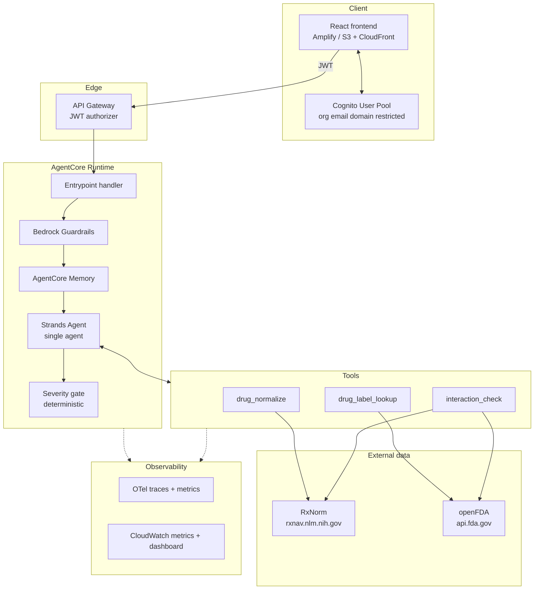

# Architecture — v1

## 1. Design principles

Four rules that decide most arguments in this codebase.

**1. Guarantees live in code, not in prompts.**
Anything that must be true — escalation fired, unsafe topic refused, absence of
evidence not reported as safety — is enforced in Python and covered by a test. The
model writes language; it does not enforce policy. A prompt that says "be careful"
fails silently and you find out from a user, months later.

**2. Cite only what was retrieved.**
The model may only assert clinical content that appears in text a tool actually
returned. If the tool returned metadata, the model has no grounding, and a citation
attached to model-recalled knowledge is a citation that does not support its claim.

**3. Absence of evidence is not evidence of absence.**
"No interaction documented in either label" and "these are safe together" are
different statements. Conflating them is the single most dangerous failure mode in
this domain, and it is a *data modelling* decision, not a wording one.

**4. Personal data is not collected by default.**
Logs carry identifiers and metrics, never message content. Memory stores distilled
context, not raw text. The absence of an org-wide view of user questions is a
deliberate design property.

---

## 2. Component view



---

## 3. Decisions and rationale

Each decision records what was chosen, what was rejected, and why — so the reasoning
survives after the context is forgotten.

### D1 — Single agent, not an orchestrator with specialists

**Chosen:** one Strands agent with several tools.
**Rejected:** keyword intent classifier routing to three specialist agents (the
previous design).

The previous classifier matched substrings. `"with"` was an interaction keyword and
`"what is"` a drug keyword, so *"What is metformin used for with diabetes"* matched
both, invoked two agents, made two model calls and two API calls, and concatenated two
answers. Cost and latency multiplied on a substring match.

Tool selection is what a tool-calling model is *for*. Giving one agent three
well-described tools makes routing a model capability rather than hand-written string
matching — fewer moving parts, better routing, one model call.

Specialist agents earn their cost when sub-agents need genuinely different models,
different system prompts, or parallel execution. None applies at this size.

### D2 — No vector store in v1

**Chosen:** direct structured retrieval from openFDA.
**Rejected:** Bedrock Knowledge Base over OpenSearch Serverless.

The retrieval key here is the drug name. "What is the dose of metformin?" needs an
exact lookup, not semantic similarity. Vector search exists for the case where query
and answer share *meaning* but not *words*, and no key exists to look up by. Drug
labels are keyed documents.

Paying for a vector database — OpenSearch Serverless bills on minimum provisioned
capacity whether queried or not, running to hundreds of USD/month idle — to find the
metformin label is paying for fuzzy search on a problem that has an exact index.

Additional benefits: labels stay current with no ingestion pipeline to keep in sync,
and there is one less subsystem to build, operate, and understand.

**This changes in v2.** Symptom and condition Q&A runs over prose (MedlinePlus and
similar) where the query genuinely does not map to a key. Vector retrieval earns its
cost there. Design the retrieval interface in v1 so the backend swaps behind one tool
implementation.

If a vector store is later needed, prefer **S3 Vectors** (purpose-built, roughly an
order of magnitude cheaper than OpenSearch Serverless; higher latency, irrelevant for
chat) or **Aurora Serverless v2 + pgvector**.

> The transferable question is *"what is my lookup key?"* before *"which vector DB?"*
> If you can name a key, you want an index. If you cannot, you want embeddings.

### D3 — Interaction data derived from label text

**Chosen:** cross-check both products' `drug_interactions` label sections.
**Rejected:** RxNav Drug Interaction API — retired.

```
GET https://rxnav.nlm.nih.gov/REST/interaction/interaction.json?rxcui=11289
→ HTTP 404 Not found
```

No free structured drug-interaction database exists. See §4.

### D4 — Two-hop rxcui join

RxNorm returns **ingredient**-level concept IDs. openFDA labels carry **product**
(SCD) level IDs. They do not match:

```
openfda.rxcui:11289   (warfarin ingredient)   → NO MATCH, every drug, always
```

Naive joining returns zero results universally — a silent, total failure that looks
like "drug not found". The verified path:

```
warfarin
  → GET rxnav.nlm.nih.gov/REST/rxcui.json?name=warfarin
      → ingredient rxcui 11289
  → GET rxnav.nlm.nih.gov/REST/rxcui/11289/related.json?tty=SCD
      → product rxcuis 855288, 855296, 855302 …
  → GET api.fda.gov/drug/label.json?search=openfda.rxcui:855288
      → MATCH
```

Name-based search (`openfda.generic_name:"warfarin"`) also works and is simpler. Use
names for the common path and the rxcui join when disambiguation matters — RxNorm
normalisation still earns its place for brand→generic mapping and misspellings.

### D5 — Severity as a typed field, not a prompt instruction

**Chosen:** the model returns a typed severity enum; Python decides what happens.
**Rejected:** "if it sounds serious, advise seeing a doctor" in the system prompt.

```python
class Severity(str, Enum):
    INFORMATIONAL = "informational"   # "what is metformin"
    LOW           = "low"             # mild, self-limiting
    MEDIUM        = "medium"          # escalate
    HIGH          = "high"            # escalate, prominent
    EMERGENCY     = "emergency"       # escalate first, answer second
```

Python reads the field and appends the escalation block deterministically. A keyword
tripwire forces `EMERGENCY` regardless of what the model returned — chest pain,
difficulty breathing, suicidal ideation, anaphylaxis, stroke signs — because model
classification alone will eventually miss one.

Prompt-only escalation is unmeasurable and untestable. A typed field is both.

### D6 — Async HTTP, not `requests`

`requests` is synchronous. Called inside an `async def` handler it blocks the event
loop thread, serialising every concurrent request through the runtime. Use `httpx.AsyncClient`
with connection pooling, and `tenacity` for retry with exponential backoff.

Both dependencies must be declared in `pyproject.toml` — they were previously imported
by unreachable code and never installed.

### D7 — Keep the observability layer

The existing OTel + CloudWatch instrumentation is the strongest code in the repository
and is retained, with one change: **prompt text is removed from all log statements.**

```python
logger.info(f"Incoming request: {prompt}")   # REMOVED — writes health data to CloudWatch
```

Logs carry event IDs, intent, token counts, latency, outcome. Never content.

---

## 4. Interaction checking

The mechanism, and why each step exists.

```
Input: two drug names
 │
 1. Normalise both via RxNorm
 │     brand → generic, misspelling → canonical, → ingredient rxcui
 │
 2. Fetch the drug_interactions section of BOTH labels from openFDA
 │
 3. Cross-check in BOTH directions, in Python:
 │     does A's interaction text mention B, B's ingredients, or B's class?
 │     does B's interaction text mention A, A's ingredients, or A's class?
 │     class matters: a label may say "NSAIDs" and never say "ibuprofen"
 │
 4. Model composes the answer from the returned text spans only
 │
 5. Severity gate → escalation
 │
Output: { documented: bool, evidence: [spans], sources: [urls], severity }
```

### The critical contract

When neither label mentions the other, the tool returns:

```python
{"documented": False,
 "message": "No interaction is documented in either product label."}
```

It must **never** surface as "these are safe together". Labels are incomplete;
absence of documentation is not evidence of safety. Python appends the caveat — it is
not left to the model's wording.

The previous implementation returned `interaction_found: False` unconditionally,
with no API call at all, for every input. Warfarin + aspirin — a serious, well
documented bleeding interaction — returned clean.

### Verified behaviour

Field-scoped search was validated against controls before being relied on:

| Query | Result | Meaning |
|---|---|---|
| `generic_name:warfarin` | 76 | baseline |
| `warfarin AND drug_interactions:aspirin` | 76 | true positive |
| `warfarin AND drug_interactions:zzzznope` | NOT_FOUND | filter works |
| `warfarin AND drug_interactions:banana` | NOT_FOUND | filter works |
| `metformin AND drug_interactions:aspirin` | NOT_FOUND | true negative |

Without the nonsense-term controls, 76/76 would have been indistinguishable from an
ignored filter.

### Size note

A single `drug_interactions` section runs to ~6,500 characters. Two labels is ~13k
characters of context per interaction query. Extract relevant spans rather than
passing whole sections, or token cost and latency grow with every query.

---

## 5. Safety controls

| # | Control | Layer | Deterministic |
|---|---|---|---|
| 1 | PII/PHI redaction | Guardrails, input | yes |
| 2 | Out-of-scope refusal | Guardrails + prompt | partly |
| 3 | Emergency keyword tripwire | Python, pre-model | yes |
| 4 | Severity classification | Model, typed enum | no — hence 3 |
| 5 | Escalation block | Python, post-model | yes |
| 6 | "Not documented ≠ safe" | Python, post-tool | yes |
| 7 | Citation requirement | Prompt + response validation | partly |
| 8 | Content excluded from logs | Logging layer | yes |
| 9 | Memory scoping and TTL | Memory config | yes |

Controls 3, 5, 6 and 8 are the ones that must never fail, and all four are pure
Python with unit tests.

---

## 6. Personal data

| Concern | Control |
|---|---|
| Health questions in logs | Prompt text never logged; IDs and metrics only |
| Health data at rest | Memory stores distilled context, not raw messages |
| Retention | Bounded TTL on memory |
| Cross-user exposure | `actorId` = Cognito `sub`; no shared namespace |
| Employer access | No org-wide query view exists by design |
| Identifiers in prompts | Guardrails redact before model and before memory |

Enabling AgentCore Memory means conversation history **is** stored in the AWS account.
The controls above make "no identifiable health data is retained" a defensible
statement rather than an assumption.

---

## 7. Deferred

| Item | Phase | Note |
|---|---|---|
| Symptom / condition Q&A | v2 | Needs MedlinePlus-class corpus + vector retrieval |
| Vector store (S3 Vectors) | v2 | Introduced with v2 corpus, not before |
| Lab report interpretation | v3 | File upload, parsing, reference ranges; highest risk |
| AgentCore Gateway | — | Not needed while tools are in-process |
| Online evaluators | v1 late | Add once response format is stable |
