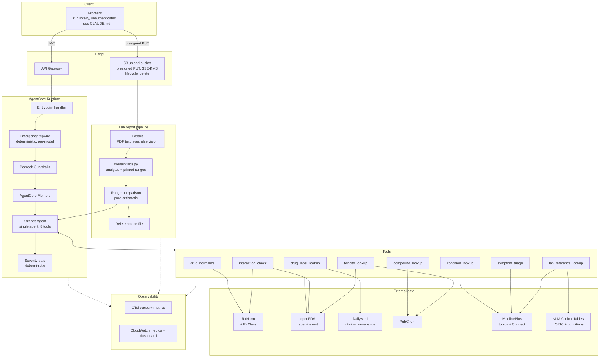

# Architecture

A health assistant for employees: drug compounds, conditions, symptoms, drug
interactions, toxicity, and lab report interpretation — grounded in retrieved source
text, with deterministic escalation to a human clinician.

## 1. Design principles

Five rules that decide most arguments in this codebase.

**1. Guarantees live in code, not in prompts.**
Anything that must be true — escalation fired, unsafe topic refused, absence of
evidence not reported as safety, a lab value flagged out of range — is enforced in
Python and covered by a test. The model writes language; it does not enforce policy.
A prompt that says "be careful" fails silently and you find out from a user, months
later.

**2. Cite only what was retrieved.**
The model may only assert clinical content that appears in text a tool actually
returned. If the tool returned metadata, the model has no grounding, and a citation
attached to model-recalled knowledge is a citation that does not support its claim.

**3. Absence of evidence is not evidence of absence.**
"No interaction documented in either label" and "these are safe together" are
different statements. "This analyte is within the printed reference range" and "you
are healthy" are different statements. Conflating either is a *data modelling*
decision, not a wording one.

**4. Arithmetic is not the model's job.**
Range comparison, unit conversion, threshold checks, and severity thresholds are
computed. The model explains a result it was handed; it never derives one.

**5. Personal data is minimised and short-lived.**
Logs carry identifiers and metrics, never message content. Memory stores distilled
context, not raw text. Uploaded lab reports are deleted once parsed. The absence of
an org-wide view of user questions is a deliberate design property.

---

## 2. Scope

| Capability | Example question | Primary source |
|---|---|---|
| Drug information | "What is metformin used for?" | openFDA label, DailyMed provenance |
| Drug compounds | "What is the molecular structure of ibuprofen?" | PubChem |
| Drug interactions | "Can I take warfarin with aspirin?" | openFDA labels both directions + RxClass |
| Toxicity / overdose | "What happens if I take too much paracetamol?" | openFDA `overdosage`, FAERS, PubChem GHS |
| Conditions | "What is hypothyroidism?" | MedlinePlus health topics |
| Symptoms | "I've had a headache for three days" | MedlinePlus + triage ruleset |
| Lab reports | uploaded PDF or phone photo | the report itself + Clinical Tables LOINC + MedlinePlus Connect |

Every source above is a US or international public service. Users are in
India. Section D14 addresses what that mismatch means and what is done about it.

Out of scope, refused by Guardrails and by prompt: diagnosis, prescribing, dose
changes to existing therapy, mental-health crisis counselling (escalated, not
answered), and anything about a third party who is not the user.

---

## 3. Component view



Two entry paths, one agent. Chat arrives as text. A lab report arrives as a file,
is reduced to typed structured data *before* any model sees it, and then enters the
same agent as structured context.

---

## 4. Decisions and rationale

Each decision records what was chosen, what was rejected, and why — so the reasoning
survives after the context is forgotten.

### D1 — Single agent, not an orchestrator with specialists

**Chosen:** one Strands agent with eight tools.
**Rejected:** keyword intent classifier routing to specialist agents.

The earlier classifier matched substrings. `"with"` was an interaction keyword and
`"what is"` a drug keyword, so *"What is metformin used for with diabetes"* matched
both, invoked two agents, made two model calls and two API calls, and concatenated
two answers. Cost and latency multiplied on a substring match.

Tool selection is what a tool-calling model is *for*. Giving one agent well-described
tools makes routing a model capability rather than hand-written string matching.

Eight tools is comfortably within what current tool-calling models route accurately.
Specialist sub-agents earn their cost when they need genuinely different models,
different system prompts, or parallel execution. None applies here — and each
sub-agent adds a full model call to the bill.

**Tool docstrings are load-bearing.** They are the routing logic. Write them as an
API contract for the model, not as notes for humans.

### D2 — Exact-key retrieval where a key exists; live prose retrieval where it does not

**Chosen:** direct structured retrieval — RxNorm, openFDA, PubChem, MedlinePlus —
behind a `retrieval` interface.
**Rejected:** a vector store (Bedrock Knowledge Base over OpenSearch Serverless) as
the primary retrieval mechanism.

Six of the eight capabilities have an exact lookup key: a drug name, an RxCUI, a
PubChem CID, a LOINC code. "What is the dose of metformin?" needs an exact lookup,
not semantic similarity. Vector search exists for the case where query and answer
share *meaning* but not *words*, and no key exists to look up by.

Conditions and symptoms are the genuine prose case. MedlinePlus exposes them through
a search API, which is a usable middle ground: no ingestion pipeline, no idle cost,
content stays current. Its recall is weaker than embeddings over the same corpus.

OpenSearch Serverless bills on minimum provisioned capacity whether queried or not —
hundreds of USD/month idle. That is not a defensible line item before the retrieval
quality has been measured against the live API it would replace.

The design commitment: `clients/retrieval.py` defines one interface. If MedlinePlus
recall proves inadequate under evaluation, the backend swaps to **S3 Vectors**
(purpose-built, roughly an order of magnitude cheaper than OpenSearch Serverless;
higher latency, irrelevant for chat) behind that same interface, touching one file.

> The transferable question is *"what is my lookup key?"* before *"which vector DB?"*
> If you can name a key, you want an index. If you cannot, you want embeddings.

### D3 — Interaction data derived from label text

**Chosen:** cross-check both products' `drug_interactions` label sections.
**Rejected:** RxNav Drug Interaction API — retired.

```
GET https://rxnav.nlm.nih.gov/REST/interaction/interaction.json?rxcui=11289
→ HTTP 404 Not found
```

No free structured drug-interaction database exists. See §5.

### D4 — Two-hop rxcui join

RxNorm returns **ingredient**-level concept IDs. openFDA labels carry **product**
(SCD) level IDs. They do not match:

```
openfda.rxcui:11289   (warfarin ingredient)   → NO MATCH, every drug, always
```

Naive joining returns zero results universally — a silent, total failure that looks
like "drug not found". The verified path:

```
warfarin
  → GET rxnav.nlm.nih.gov/REST/rxcui.json?name=warfarin
      → ingredient rxcui 11289
  → GET rxnav.nlm.nih.gov/REST/rxcui/11289/related.json?tty=SCD
      → product rxcuis 855288, 855296, 855302 …
  → GET api.fda.gov/drug/label.json?search=openfda.rxcui:855288
      → MATCH
```

Name-based search (`openfda.generic_name:"warfarin"`) also works and is simpler. Use
names for the common path and the rxcui join when disambiguation matters — RxNorm
normalisation still earns its place for brand→generic mapping and misspellings.

### D5 — Severity as a typed field, not a prompt instruction

**Chosen:** the model returns a typed severity enum; Python decides what happens.
**Rejected:** "if it sounds serious, advise seeing a doctor" in the system prompt.

```python
class Severity(str, Enum):
    INFORMATIONAL = "informational"   # "what is metformin"
    LOW           = "low"             # mild, self-limiting
    MEDIUM        = "medium"          # escalate
    HIGH          = "high"            # escalate, prominent
    EMERGENCY     = "emergency"       # escalate first, answer second
```

Python reads the field and appends the escalation block deterministically. A keyword
tripwire forces `EMERGENCY` regardless of what the model returned — chest pain,
difficulty breathing, suicidal ideation, anaphylaxis, stroke signs — because model
classification alone will eventually miss one.

Severity has three independent inputs, and the **maximum wins**: the tripwire, the
model's classification, and any deterministic floor raised by a tool (a critical lab
value, a documented high-severity interaction). No input can lower another's result.

Prompt-only escalation is unmeasurable and untestable. A typed field is both.

### D6 — Async HTTP, not `requests`

`requests` is synchronous. Called inside an `async def` handler it blocks the event
loop thread, serialising every concurrent request through the runtime. Use
`httpx.AsyncClient` with connection pooling, and `tenacity` for retry with
exponential backoff.

With eight tools over four upstreams, concurrency is no longer an optimisation. An
interaction check is two label fetches; a toxicity question is three upstream calls.
Sequential `await` multiplies latency by the number of sources.

### D7 — Keep the observability layer, without content

The existing OTel + CloudWatch instrumentation is the strongest code in the repository
and is retained, with one change: **prompt text is removed from all log statements.**

```python
logger.info(f"Incoming request: {prompt}")   # REMOVED — writes health data to CloudWatch
```

Logs carry event IDs, tool names, token counts, latency, severity, outcome. Never
content. This applies to lab data with particular force: an analyte name and value
is health data about an identifiable employee.

### D8 — Lab report extraction: text layer first, vision as fallback

Reports arrive as **PDF or phone photo**, and the two are not one problem.

| Input | Path | Why |
|---|---|---|
| PDF with a text layer | extract text directly | Exact characters. No OCR error, no model cost, milliseconds. |
| Scanned PDF (no text layer) | render pages → vision model | No text to extract. |
| Phone photo (JPEG/PNG/HEIC) | vision model | Same. |

Detection is mechanical: extract the text layer; if it yields below a threshold of
characters per page, treat the page as an image.

A digital lab-portal PDF gives you the exact printed value. A vision model reading
the same PDF might return `1.O` for `1.0`. Never pay a model to guess at characters
that are already in the file.

**Rejected as the default:** Amazon Textract for everything. Textract's forms/tables
analysis is strong on ruled tabular layouts and is a reasonable alternative for the
image path — but it bills per page, requires its own output-parsing layer, and does
not remove the need for the text-layer fast path. The image path's engine is a
swappable implementation detail behind `extract()`.

### D9 — Reference ranges are read from the report, not from a table

**Chosen:** parse the reference range printed alongside each analyte.
**Rejected:** a curated reference-range table as the primary source.

Reference ranges are not universal. They vary by laboratory, by assay method, by
age, by sex, and by pregnancy status. The report itself was produced by the lab that
knows its own assay, and it prints its own ranges next to the results.

A hardcoded table would silently produce wrong flags for every lab whose assay
differs from the one the table was built from — and it would be wrong in a way no
test catches, because the test fixture would use the table's own numbers.

A curated table exists **only** as a fallback for analytes where no range was printed,
and a result flagged from the fallback table is labelled as such in the output. The
user is told which reference was used.

### D10 — Range comparison is arithmetic, in Python

The model never decides whether a value is high, low, or normal.

```
Analyte(name, value, unit, ref_low, ref_high, ref_source)
  → Python: below / within / above / critical
  → model: explains the flag in plain language
```

This is D1 and principle 4 applied to the highest-risk surface in the product.
Language models do not reliably compare decimals, handle unit prefixes, or notice
that 1.2 mg/dL and 106 µmol/L are the same creatinine. Arithmetic is free, exact, and
unit-testable; model reasoning about arithmetic is none of those.

Unit normalisation happens before comparison, and an **unrecognised unit is an error,
not a guess**. A value whose unit cannot be reconciled with its range is reported as
"could not be verified", never silently compared.

### D11 — Toxicity is three sources, and FAERS is not causality

A toxicity or overdose question draws on:

| Source | Gives | Caveat carried into the answer |
|---|---|---|
| openFDA label `overdosage` | The manufacturer's overdose guidance | Authoritative, but product-specific |
| openFDA `/drug/event.json` (FAERS) | Counts of reported adverse events | **Spontaneous reports. Not incidence, not causality.** |
| PubChem GHS classification | Chemical hazard data | Chemical-level, not therapeutic-dose context |

The FAERS caveat is enforced in Python, exactly like the interaction contract in §5.
A count of 4,000 reports does not mean an event is common or that the drug caused it —
FAERS has no denominator and no verification. Any tool response carrying FAERS data
carries the caveat as a field, and the response validator rejects an answer that cites
FAERS counts without it.

Any overdose question with a first-person present-tense framing ("I took", "I've
taken") is an emergency tripwire match before any of this runs.

### D12 — Symptom triage is a deterministic ruleset, not model judgement

Symptoms are the highest-volume and highest-ambiguity path. MedlinePlus supplies
description; it does not supply triage.

`domain/triage.py` holds an explicit red-flag ruleset — combinations of symptom,
duration, and modifier that force a severity floor regardless of model output.
Examples of shape, not the final list: chest pain of any duration; headache described
as sudden and severe; shortness of breath at rest; any neurological deficit.

Two properties matter. It is **reviewable** — a clinician can read the ruleset and
say whether it is right, which they cannot do for a prompt. And it is **testable** —
every rule is a unit test with no model call.

The model's severity classification runs alongside it. Maximum wins (D5).

### D13 — Uploaded files are deleted, and never stored in memory

The lab pipeline's data lifecycle:

```
presigned PUT → S3 (SSE-KMS, 1-day lifecycle rule)
  → extract → parse → typed analytes
  → delete object immediately after parse
  → analytes held in request scope only
  → Memory receives: "discussed a lipid panel", never the values
```

The uploaded file never reaches CloudWatch, never reaches Memory, and does not
outlive the request. The S3 lifecycle rule is a backstop for a crashed request, not
the primary deletion path.

Storing reports would enable trend analysis over time — genuinely useful, and
explicitly not built. Doing so turns this system into a medical records system, with
the retention, access-control, and disclosure obligations that implies.

### D14 — Indian brand names resolved locally; source jurisdiction always stated

**Chosen:** a curated brand-alias map in `domain/`, applied before RxNorm.
**Rejected:** relying on RxNorm alone; scraping an Indian drug portal.

Every upstream in this system is American. RxNorm normalises US drug
names; openFDA serves US labels. An employee in India types *"Dolo 650"*
or *"Combiflam"* and the whole stack returns nothing -- not a wrong
answer, silence, which reads as a broken product on day one.

There is no authoritative Indian equivalent to substitute:

| Source | Status |
|---|---|
| CDSCO | Approvals published as year-wise, department-wise pages. No unified list, no API. |
| NLEM 2022, Jan Aushadhi basket (2,110 medicines) | PDF. |
| Third-party compilations | Unvetted, unversioned, no regulator behind them. |

So the mapping is ours, and it is small on purpose: the brands roughly a
hundred employees actually take, perhaps 100-200 entries. `dolo` and
`crocin` to paracetamol, `combiflam` to ibuprofen plus paracetamol,
`augmentin` to amoxicillin plus clavulanate. Once resolved to a generic
ingredient, RxNorm and openFDA work normally.

Three properties make this acceptable rather than a hack. It is
**reviewable** by a pharmacist, which a scraped dataset is not. It is
**version-controlled**, so a change is a diff. And it is **inert** --
a mapping from a name to an ingredient asserts no clinical content, so
being wrong produces "not found", not a wrong answer.

**The jurisdiction rule.** Every answer names the country of the source
it came from: *"The US prescribing information for paracetamol says…"*.
Indian formulations genuinely differ -- Dolo 650 is a 650 mg strength
with no common US equivalent -- and a US label presented as though it
described the tablet in the user's hand is a citation that does not
support its claim (principle 2). Enforced in Python at response
assembly, not left to the model's phrasing.

Unmapped brand names are reported as unmapped. The system says "I do not
recognise that brand name; what is the generic name or active
ingredient?" It never guesses at a mapping from model recall.

### D15 — Class membership from RxClass, not a local list

**Chosen:** RxClass (`rxnav.nlm.nih.gov/REST/rxclass`) for drug-class
membership in both directions.
**Rejected:** a hand-maintained class table in this repository.

Interaction sections name classes far more often than individual drugs:
a label warns about *"NSAIDs"* and never writes *"ibuprofen"*. Class
matching is therefore load-bearing, not an enhancement (see section 5).

A local table goes stale silently, and its staleness surfaces as a
*missed interaction* rather than as a failing test. RxClass answers both
directions from maintained terminologies:

```
warfarin (11289) → ATC B01AA "Vitamin K antagonists"
ATC M01A (NSAIDs) → 60 members, including ibuprofen
```

**`relaSource` must be pinned.** Unfiltered, RxClass returns every
source at once, and MED-RT contributes `may_treat` and `contraindication`
relations alongside genuine classes -- warfarin comes back "classed" as
*Abortion, Threatened* and *Alcoholism*. Feeding that into an interaction
check produces confident nonsense. The client requests ATC, deliberately,
and treats anything else as a separate question.

### D16 — A fuzzy name match is confirmed by the user, never by a threshold

**Chosen:** an approximate match is returned flagged, and the caller asks
the user before using it.
**Rejected:** accepting a match above a similarity or confidence score.

The first implementation used RxNorm's own `approximateTerm` score with a
threshold. That failed immediately: the score is unbounded and scales
with term length -- `warfarin` scores 12.06, `metformn` 8.18 -- so any
fixed number is meaningless.

Measuring string similarity instead does not rescue the idea:

```
0.909  prednisone -> prednisolone   DIFFERENT DRUG
0.875  metfrmn    -> metformin      typo
```

A genuinely different drug scores **higher** than a real typo. Prednisone
and prednisolone differ in potency; losartan and valsartan are different
molecules. No threshold separates those cases, because the information
needed to separate them is not in the string. Tuning the number moves the
errors around; it never removes them.

So the gate is a question. `DrugRef.requires_confirmation` is set on every
approximate match, and the tool asks: *"Did you mean metformin?"* Asking
costs one turn. Being wrong answers a question about a medicine the user
is not taking, in language that sounds certain.

RxNorm already does the coarse filtering -- genuine nonsense returns no
candidates at all -- so the similarity check that remains exists only to
discard absurd suggestions, and is documented as not being a safety
control.

> The transferable question: *does the information needed to make this
> decision exist in the data I am measuring?* If it does not, no
> threshold over that data will work, and the decision belongs to
> someone who has the missing information. Here that is the user.

### D17 — The guardrail does scope, not safety, and must not filter distress

**Chosen:** a project-specific Bedrock guardrail limited to scope control
and PII redaction.
**Rejected:** reusing the organisation's existing assistant guardrails,
and a conventional health guardrail with self-harm filtering on input.

The two guardrails already in the account are scoped to an IT and HR
assistant. Their denied topics and filters describe a different product,
and inheriting them would mean this system's scope was decided by
somebody else's requirements.

The second rejection is the important one. The obvious configuration for
a health product filters self-harm content on **input**. Do that, and a
person typing *"I want to kill myself"* receives a canned refusal,
because Guardrails stops the message before the system sees it.

`domain/severity.py` already handles that case: a self-harm tripwire
forces `EMERGENCY` and returns crisis guidance, before the model runs. An
input filter would not add safety; it would destroy the one response that
matters.

So the guardrail denies **self-harm methods** -- lethal doses, "which
medicine kills" -- while distress reaches the tripwire untouched. The
distinction lives in the topic definition, where a reviewer can check it.

The same reasoning applies to violence and sexual content: label text
describes bleeding, overdose and death, and covers contraception and
sexual dysfunction. Input filtering is off; output filtering is low.

**AGE is deliberately not redacted.** Bedrock can anonymise it as PII, and
`domain/triage.py` reads age and pregnancy to decide urgency -- fever in
pregnancy reaches `HIGH`. Redacting a field the safety layer depends on is
a safety change wearing a privacy setting's clothes. Names, emails, phone
numbers, addresses, Aadhaar and PAN are anonymised, since employees paste
lab reports carrying them.

**Contextual grounding is not enabled.** The filter scores an answer
against a declared grounding source, and Strands does not tag retrieved
tool results as one -- so it would have nothing to compare against.
Groundedness is measured by evaluators instead, where the retrieved text
is actually available.

**Testing removed a topic and disabled output filtering.** Written as a
topic, "self-harm methods" blocked *"I feel like I want to kill myself"*
and *"I just took 30 paracetamol tablets"* -- both of which must reach
the tripwire -- and narrowing it to quantities did not help, because
topic policies take no negative examples and the two phrasings are
semantically adjacent. The rule moved to the system prompt.

Topic policies also run on OUTPUT, where "prescribing and dose changes"
matched the system's own answers: a correct answer quotes the label's
dosing text. Every topic now sets `outputEnabled: false`. These topics
describe what a user may ASK for, not what the assistant may say.

> The transferable point: a guardrail is a filter, not a policy engine. It
> can stop a bad question reaching the model. It cannot make an answer
> correct, and configuring it as though it could moves a guarantee out of
> code that can be tested and into a service that cannot.
>
> And a topic policy is a semantic classifier -- too blunt wherever the
> boundary is one word wide. Verify each topic against the phrasings it
> must NOT catch, not only the ones it must.

### D18 — An answer with no tool call is replaced, whatever it says

**Chosen:** the response assembler discards any answer produced without
a single tool invocation.
**Rejected:** a scope instruction in the system prompt; a guardrail
denied-topic list of off-topic subjects.

The prompt already said to use tools for everything factual and to stay
in scope. The deployed assistant explained the Strands tool-calling API
and then debugged a Python function -- fluently, confidently, and with
no tool call behind either.

A denied-topic list cannot fix this, because scope here is an
**allow-list problem**: the topics that belong are few and nameable, the
topics that do not are infinite. Guardrails enumerate what is banned.

Tool use is the signal that was already there. Every question this
system exists for reaches at least one of eight tools. A question that
reaches none was answered from the model's own memory -- ungrounded by
definition, and exactly what an off-topic answer looks like. One rule
catches both, and it needs no guess about what people will ask.

The exception is a confirmation request: *"Did you mean metformin?"* is
a legitimate reply with nothing looked up yet, so a pending confirmation
counts as grounding.

Two details matter. **Citations and caveats are dropped** along with the
answer -- a refusal citing sources claims grounding it does not have.
And **the escalation is not dropped**: if the tripwire fired, urgent
guidance stands regardless of whether the model managed to call
anything. A model failing to use a tool must not be able to suppress an
emergency block.

> The transferable point: when a rule is about what the model may
> *discuss*, look for a signal in what the model *did*. Behaviour is
> observable and testable; intent is neither.

---

## 5. Interaction checking

The mechanism, and why each step exists.

```
Input: two drug names
 │
 0. Resolve Indian brand names locally (D14)
 │     "Combiflam" → ibuprofen + paracetamol
 │     unmapped → ask for the generic name; never guess
 │
 1. Normalise both via RxNorm
 │     brand → generic, misspelling → canonical, → ingredient rxcui
 │
 2. Fetch class membership for both via RxClass, relaSource=ATC (D15)
 │
 3. Fetch the drug_interactions section of BOTH labels from openFDA
 │
 4. Cross-check in BOTH directions, in Python:
 │     does A's interaction text mention B, B's ingredients, or B's ATC classes?
 │     does B's interaction text mention A, A's ingredients, or A's ATC classes?
 │     class matters: a label may say "NSAIDs" and never say "ibuprofen"
 │
 5. Model composes the answer from the returned text spans only
 │
 6. Severity gate → escalation
 │
Output: { documented: bool, evidence: [spans], sources: [urls],
          jurisdiction: "US", severity }
```

### The critical contract

When neither label mentions the other, the tool returns:

```python
{"documented": False,
 "message": "No interaction is documented in either product label."}
```

It must **never** surface as "these are safe together". Labels are incomplete;
absence of documentation is not evidence of safety. Python appends the caveat — it is
not left to the model's wording.

The previous implementation returned `interaction_found: False` unconditionally,
with no API call at all, for every input. Warfarin + aspirin — a serious, well
documented bleeding interaction — returned clean.

### Verified behaviour

Field-scoped search was validated against controls before being relied on:

| Query | Result | Meaning |
|---|---|---|
| `generic_name:warfarin` | 76 | baseline |
| `warfarin AND drug_interactions:aspirin` | 76 | true positive |
| `warfarin AND drug_interactions:zzzznope` | NOT_FOUND | filter works |
| `warfarin AND drug_interactions:banana` | NOT_FOUND | filter works |
| `metformin AND drug_interactions:aspirin` | NOT_FOUND | true negative |

Without the nonsense-term controls, 76/76 would have been indistinguishable from an
ignored filter.

**Every upstream gets this treatment before it is trusted.** A probe script per
client, with positive controls, negative controls, and nonsense controls, recorded in
the repository. An API that appears to work and is silently ignoring your filter is
the failure mode that reaches production.

### Size note

A single `drug_interactions` section runs to ~6,500 characters. Two labels is ~13k
characters of context per interaction query. Extract relevant spans rather than
passing whole sections, or token cost and latency grow with every query.

---

## 6. Lab report interpretation

```
PDF or photo
 │
 1. Presigned PUT to S3. File never passes through the API payload.
 │
 2. Extract
 │     PDF with text layer → direct text extraction
 │     scanned PDF / photo  → vision model
 │
 3. Parse → [Analyte(name, value, unit, ref_low, ref_high, ref_source)]
 │     ranges read from the report (D9)
 │     unparseable rows are REPORTED, never dropped silently
 │
 4. Normalise units, then compare — pure arithmetic (D10)
 │     below / within / above / critical
 │     unreconcilable unit → "could not be verified"
 │
 5. Map analyte name → LOINC via NLM Clinical Tables, then LOINC →
 │    MedlinePlus Connect for a consumer-language description of the test.
 │    A LOW-CONFIDENCE match attaches NO description (see below).
 │
 6. Model explains the flags. It does not produce them.
 │
 7. Severity floor from any critical value. Gate → escalation.
 │
 8. Delete the uploaded object.
 │
Output: { analytes: [...], flags: [...], unparsed: [...], severity, escalation }
```

### Test identity is a match, and matches can be wrong

The pipeline as first drawn read "LOINC → MedlinePlus Connect". It never
said where the LOINC code comes from. A report prints text:

```
Hemoglobin        13.2 g/dL      13.0 - 17.0
```

NLM Clinical Tables maps that text to a code -- but `hemoglobin` returns
**508 LOINC items**, and the highest-ranked are carboxyhaemoglobin
variants, not the haemoglobin on a routine blood count. Taking the first
result attaches the wrong test's description to a real patient value.

So the match is scored, and a low-confidence match yields **no
description at all** rather than a plausible wrong one. Which test a
number belongs to is not a question to answer by ranking.

### Three contracts that must not fail

**Unparsed rows are surfaced.** If the extractor produced twelve rows and the parser
understood nine, the answer says so. A partial reading presented as complete is a user
believing their unmentioned result was normal.

**A weak test match attaches no description.** If the analyte name cannot be
matched to a LOINC code with confidence, the value is still parsed, flagged and
reported -- but with no explanation of what the test is. Silence about the test is
recoverable; a confident description of a different test is not.

**"Within range" is not "you are fine".** Every lab response carries the statement
that reference ranges are population statistics, that a normal panel does not exclude
disease, and that interpretation belongs to the clinician who ordered the test. In
Python, not in the prompt.

---

## 7. Safety controls

| # | Control | Layer | Deterministic |
|---|---|---|---|
| 1 | PII/PHI redaction | Guardrails, input (not AGE -- D17) | yes |
| 2 | Out-of-scope refusal | Guardrails denied topics + prompt | partly |
| 3 | Emergency keyword tripwire | Python, pre-model | yes |
| 4 | Symptom red-flag ruleset | Python, `domain/triage.py` | yes |
| 5 | Severity classification | Model, typed enum | no — hence 3 and 4 |
| 6 | Severity maximum-wins combination | Python, post-model | yes |
| 7 | Escalation block | Python, post-model | yes |
| 8 | "Not documented ≠ safe" | Python, post-tool | yes |
| 9 | FAERS "not causality" caveat | Python, post-tool | yes |
| 10 | Lab range comparison | Python, arithmetic | yes |
| 11 | Unparsed lab rows surfaced | Python, post-parse | yes |
| 12 | "In range ≠ healthy" statement | Python, post-parse | yes |
| 13 | Citation requirement | Prompt + response validation | partly |
| 14 | Source jurisdiction stated (D14) | Python, response assembly | yes |
| 15 | Unmapped brand reported, never guessed | Python, `domain/brands.py` | yes |
| 16 | Weak LOINC match attaches no description | Python, `domain/labs.py` | yes |
| 17 | Fuzzy drug-name match confirmed by the user (D16) | Python, `utils/rxnorm.py` | yes |
| 18 | Ungrounded/off-scope answer replaced (D18) | Python, `domain/response.py` | yes |
| 19 | Content excluded from logs | Logging layer | yes |
| 20 | Uploaded file deletion | Pipeline + S3 lifecycle | yes |
| 21 | Memory scoping and TTL | Memory config | yes |

Everything marked deterministic is pure Python with unit tests and no model call.
That is the majority of the safety surface, by design.

---

## 8. Personal data

| Concern | Control |
|---|---|
| Health questions in logs | Prompt text never logged; IDs and metrics only |
| Lab values in logs | Analyte names and values never logged; counts only |
| Health data at rest | Memory stores distilled context, not raw messages or values |
| Uploaded reports | Deleted after parse; S3 lifecycle as backstop; SSE-KMS at rest |
| Retention | Bounded TTL on memory |
| Cross-user exposure | `actorId` from an authenticated identity; no shared namespace — needs real auth in front of the API first, see CLAUDE.md |
| Employer access | No org-wide query view exists by design |
| Identifiers in prompts | Guardrails redact before model and before memory |
| Identifiers on the report | Name, DOB, patient ID redacted at parse, before the model |

Lab report upload means employee health data enters the AWS account. The controls
above make "no identifiable health data is retained" a defensible statement rather
than an assumption — but the decision to accept that data at all is an organisational
one, not a technical one, and should be recorded as such.

---

## 9. Deliberately not built

| Item | Why |
|---|---|
| Storing lab reports or trend history | Turns this into a medical records system (D13) |
| Vector store as primary retrieval | Not justified before measuring live-API recall (D2) |
| AgentCore Gateway | Not needed while tools are in-process |
| Diagnosis or prescribing | Refused; the escalation path exists for this |
| Third-party questions | The system answers for the authenticated user only |
| Mobile app | After the web dashboard is proven in use |
| Literature retrieval (Europe PMC, PubMed) | Both work and need no key. Research abstracts are not consumer guidance; grounding "can I take X with Y" in a case report is worse than saying "not documented". |
| Scraped Indian drug datasets | Unvetted, unversioned, no regulator behind them. Nothing clinical may rest on one; see D14. |
| WHO ICD-11 | Works, but needs OAuth registration to serve clinician-facing codes no employee ever sees. |
| RxNav Interaction API | Retired. Verified live: HTTP 404 (D3). |
