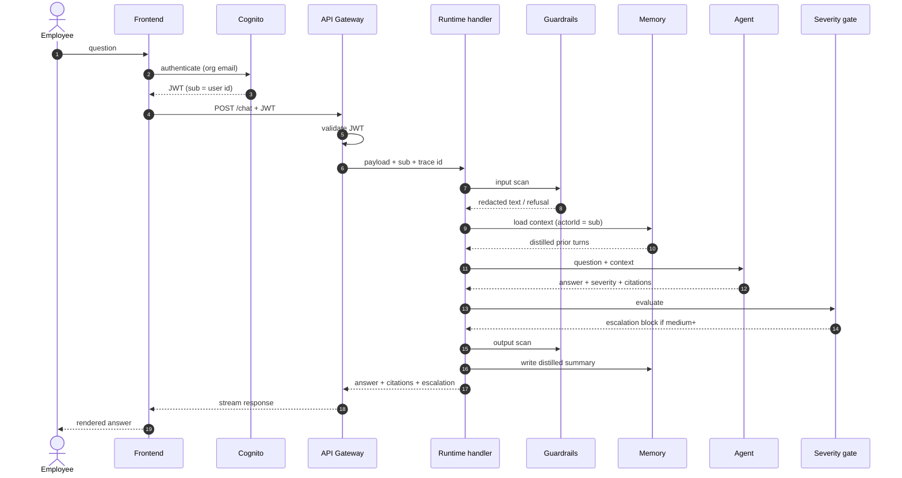
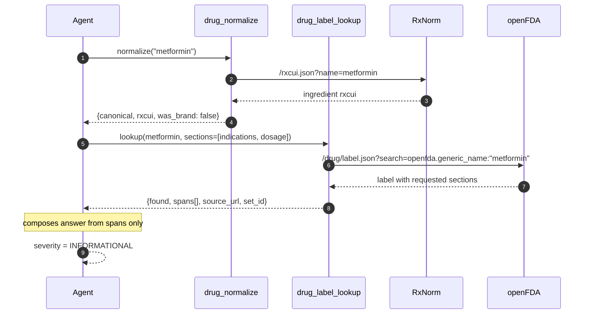
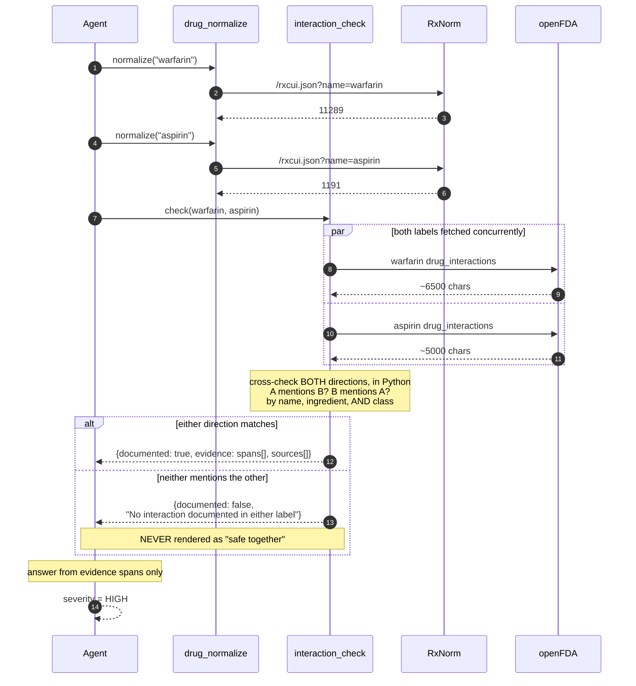
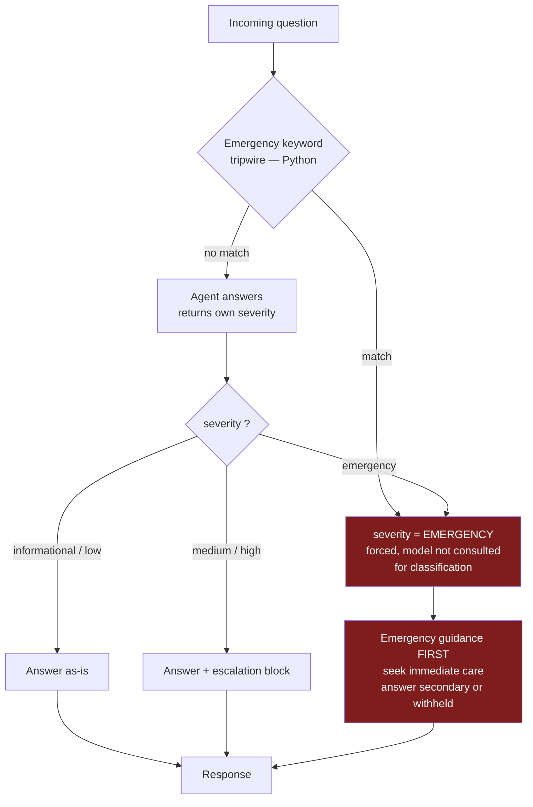

# Data flow — v1

Three documented flows: a simple drug question, an interaction question, and an
emergency. Together they exercise every layer.

---

## 1. Request lifecycle

Every request, regardless of type.

Note what crosses each boundary. The raw question reaches Guardrails and the model.
It does **not** reach the logs, and only a distilled form reaches memory.

---

## 2. Simple drug question

> *"What is metformin used for?"*

No escalation — `INFORMATIONAL` is below the medium threshold.

---

## 3. Interaction question

> *"Can I take warfarin with aspirin?"*

This is the flow that matters most.

### Why both directions

Labels are not symmetric. Warfarin's label may discuss aspirin while aspirin's label
never names warfarin, or vice versa. Checking one direction halves the detection rate
for no saving.

### Why class matching

A label may say *"NSAIDs"* and never write *"ibuprofen"*. Exact-string matching on the
drug name misses every class-level warning — which is most of them.

### Fetch both concurrently

Two independent HTTP calls. Sequential `await` doubles latency for no reason; use
`asyncio.gather`. This is why `httpx.AsyncClient` replaces `requests` — sync calls in
an async handler block the event loop and serialise everything.

---

## 4. Emergency path

> *"I've had crushing chest pain for an hour and my left arm is numb"*

The tripwire runs **before** the model and overrides it. Model classification is good
but not perfect, and the cost of missing one cardiac presentation is not symmetric
with the cost of over-escalating a false positive.

---

## 5. What crosses each boundary

| Boundary | Carries | Never carries |
|---|---|---|
| Frontend → API Gateway | question, JWT | credentials in body |
| API Gateway → Runtime | question, Cognito `sub`, trace id | raw tokens |
| Runtime → Guardrails | raw question | — |
| Guardrails → Model | redacted question | direct identifiers |
| Runtime → Memory | distilled summary | raw message text |
| Runtime → Logs | event id, intent, latency, outcome | **question or answer text** |
| Runtime → Metrics | counts, durations | any content |
| Tools → External APIs | drug names only | user identity, any PHI |

The last row matters: openFDA and RxNorm receive drug names and nothing else. No user
identifier ever leaves the account.

---

## 6. Failure handling

| Failure | Behaviour |
|---|---|
| RxNorm unavailable | Fall back to raw name against openFDA; flag reduced confidence |
| openFDA unavailable | No grounding → refuse to answer clinically; say the source is unavailable |
| Drug not found | State not found; do **not** answer from model knowledge |
| Only one label retrieved | Report one-sided check explicitly; do not imply a full check |
| Guardrail refusal | Return refusal; no model call |
| Memory unavailable | Proceed stateless; degrade, do not fail |
| Model error | Generic failure; never a partial clinical answer |

The theme: **degrade to "I cannot answer", never to an ungrounded answer.** In this
domain a confident wrong answer is worse than no answer.
