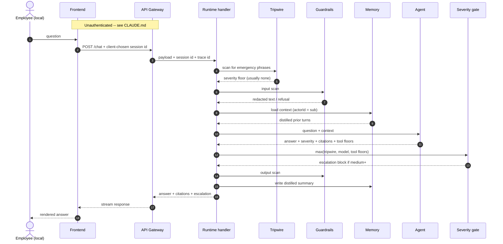
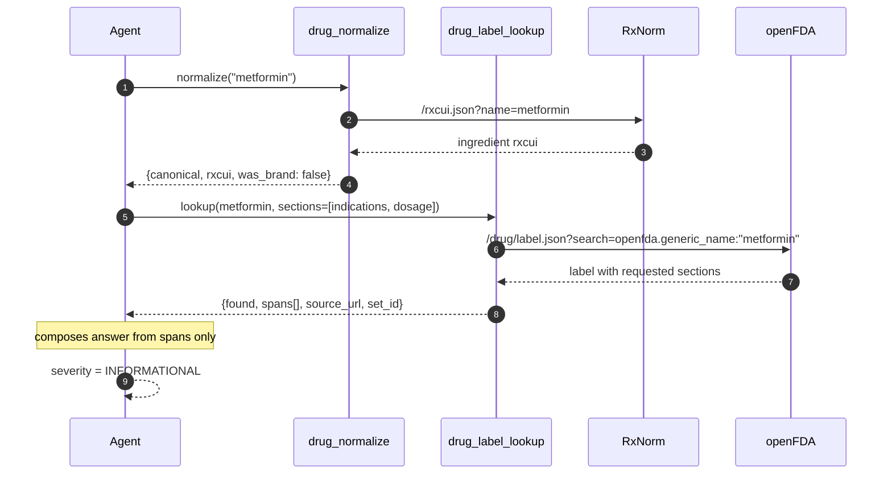
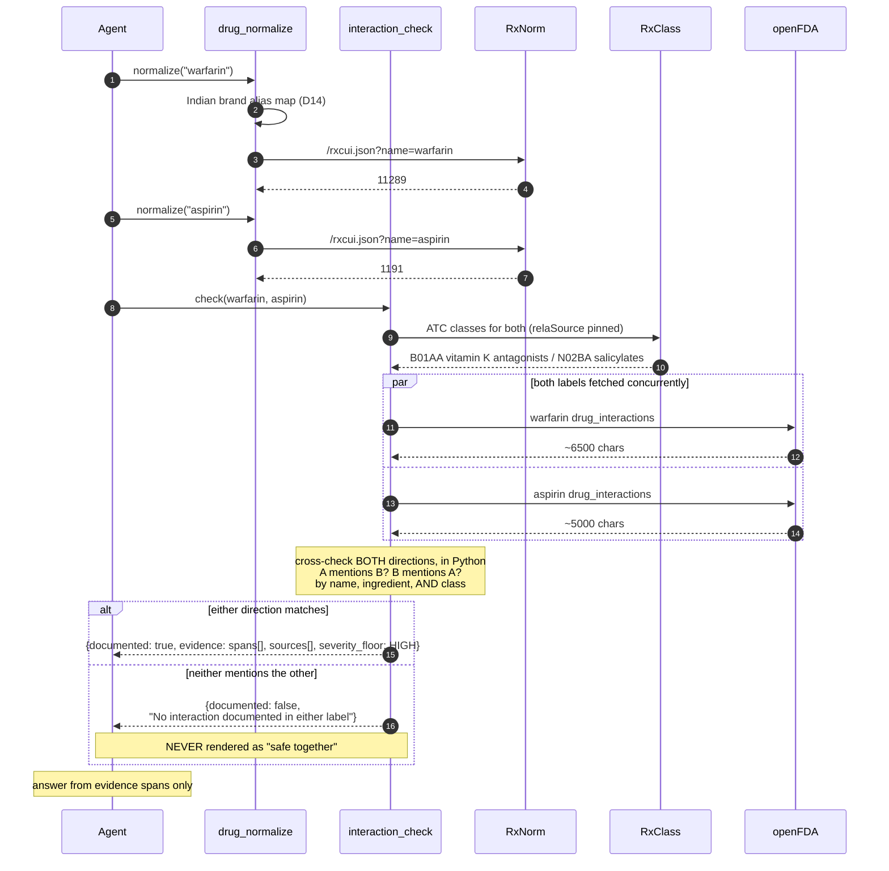
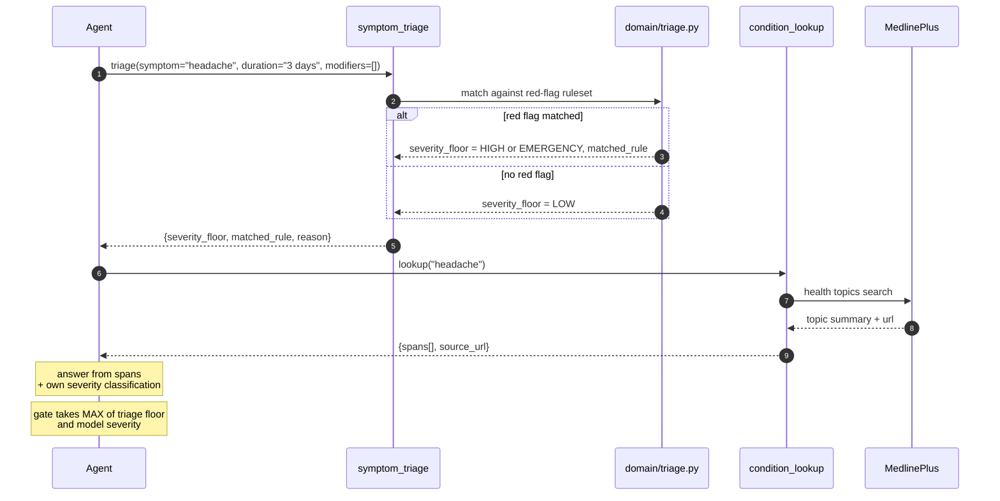
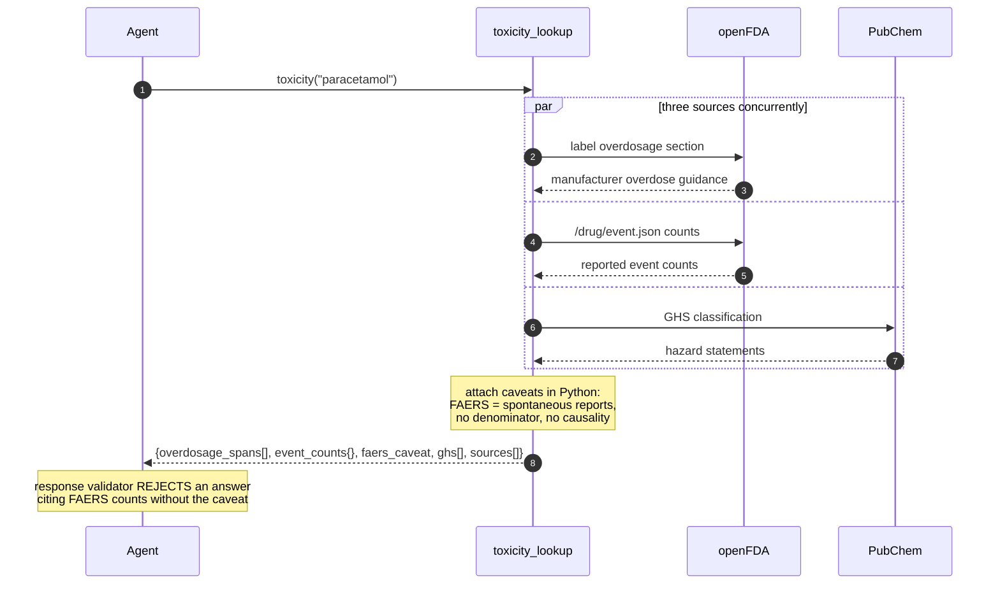
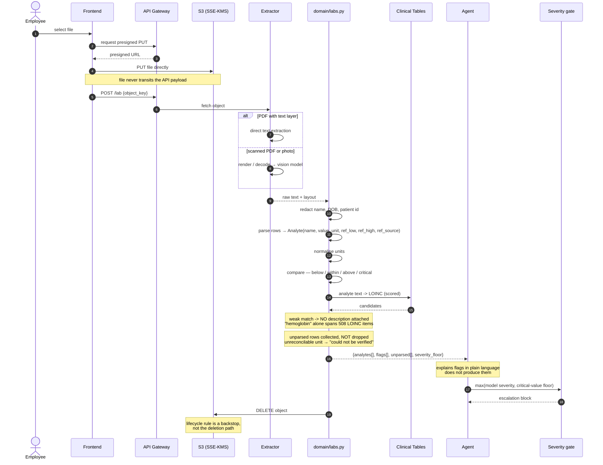
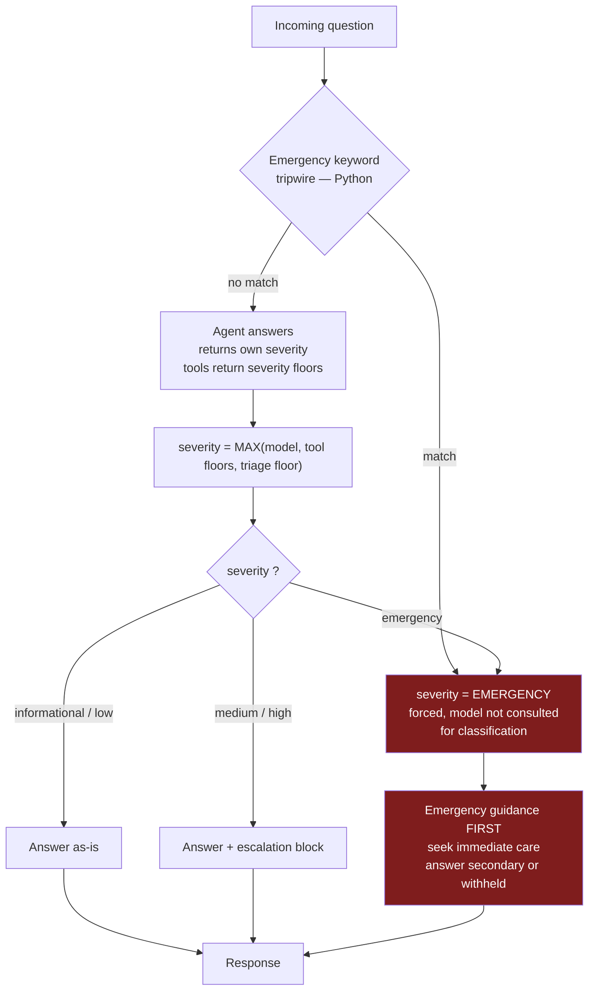

# Data flow

Seven documented flows. Together they exercise every layer and every safety control.

| # | Flow | Exercises |
|---|---|---|
| 1 | Request lifecycle | Auth, guardrails, memory, gate |
| 2 | Drug question | Normalisation, label retrieval, citation |
| 3 | Interaction question | Concurrency, bidirectional cross-check, the "not documented" contract |
| 4 | Condition / symptom question | Prose retrieval, triage ruleset |
| 5 | Toxicity question | Multi-source fan-out, FAERS caveat |
| 6 | Lab report | Upload, extract, parse, arithmetic, deletion |
| 7 | Emergency | Tripwire override |

---

## 1. Request lifecycle

Every text request, regardless of type.

Note what crosses each boundary. The raw question reaches the tripwire, Guardrails and
the model. It does **not** reach the logs, and only a distilled form reaches memory.

The tripwire runs *before* Guardrails deliberately: redaction can remove the words the
tripwire matches on.

---

## 2. Drug question

> *"What is metformin used for?"*

No escalation — `INFORMATIONAL` is below the medium threshold.

A compound question (*"what is ibuprofen's molecular weight?"*) follows the same
shape through `compound_lookup` against PubChem, and carries no severity at all: it is
chemistry, not clinical advice.

---

## 3. Interaction question

> *"Can I take warfarin with aspirin?"*

This is the flow that matters most.

### Why both directions

Labels are not symmetric. Warfarin's label may discuss aspirin while aspirin's label
never names warfarin, or vice versa. Checking one direction halves the detection rate
for no saving.

### Why class matching

A label may say *"NSAIDs"* and never write *"ibuprofen"*. Exact-string matching on the
drug name misses every class-level warning — which is most of them.

Class membership comes from RxClass rather than a table in this repository (D15), and
`relaSource` is pinned to ATC. Unfiltered, RxClass mixes in MED-RT `may_treat` and
`contraindication` relations: warfarin comes back "classed" as *Alcoholism* and
*Abortion, Threatened*. Those are real relations, and they are not drug classes.

### Fetch both concurrently

Two independent HTTP calls. Sequential `await` doubles latency for no reason; use
`asyncio.gather`. This is why `httpx.AsyncClient` replaces `requests` — sync calls in
an async handler block the event loop and serialise everything.

---

## 4. Condition and symptom question

> *"I've had a headache for three days"*

Two tools, and the second one is the safety-critical half.

### Why triage is separate from lookup

MedlinePlus tells you what a headache *is*. It does not tell you that "sudden, severe,
worst of my life" is a subarachnoid-haemorrhage presentation that needs an emergency
department now. That judgement is encoded in `domain/triage.py` as explicit rules, so
a clinician can review it and a test can verify it.

The parsing of a free-text symptom description into `(symptom, duration, modifiers)`
is the model's job — language understanding. The decision about what that tuple means
is the ruleset's job. Split along that line consistently.

---

## 5. Toxicity question

> *"What happens if someone takes too much paracetamol?"*

If the same question is asked in the first person present tense — *"I took too much
paracetamol"* — the tripwire fires at step 1 of the lifecycle and this flow never runs
as an information request. Paracetamol overdose is time-critical and initially
asymptomatic, which is exactly the case where a calm informational answer does harm.

---

## 6. Lab report

> *user uploads a PDF or a phone photo*

### The three things that must hold

| Must hold | Enforced where |
|---|---|
| Flags come from arithmetic, never from the model | `domain/labs.py` |
| Unparsed rows appear in the answer | `domain/labs.py`, response assembly |
| A weak LOINC match attaches no description | `domain/labs.py` |
| "Within range" never renders as "you are healthy" | Python-appended statement |

### Why the file bypasses the API payload

A presigned PUT sends the file browser → S3 directly. Routing a multi-megabyte photo
through API Gateway means base64 inflation, a payload size limit, the file in request
logs, and the file in memory in the handler. The presigned URL is scoped to one key,
one method, and a few minutes.

---

## 7. Emergency path

> *"I've had crushing chest pain for an hour and my left arm is numb"*

The tripwire runs **before** the model and overrides it. Model classification is good
but not perfect, and the cost of missing one cardiac presentation is not symmetric
with the cost of over-escalating a false positive.

**Maximum wins, always.** No component can lower a severity another component raised.
That property is a single function with exhaustive unit tests, and it is the reason
the system can carry six independent severity inputs without any of them being able
to undo another.

---

## 8. What crosses each boundary

| Boundary | Carries | Never carries |
|---|---|---|
| Frontend → API Gateway | question, JWT, object key | credentials in body, file bytes |
| Frontend → S3 | file bytes, presigned URL | user identity beyond the key |
| API Gateway → Runtime | question, session id, trace id | raw tokens |
| Runtime → Tripwire | raw question | — |
| Runtime → Guardrails | raw question | — |
| Guardrails → Model | redacted question | direct identifiers |
| Extractor → Parser | raw report text | — |
| Parser → Model | redacted analytes | name, DOB, patient id |
| Runtime → Memory | distilled summary | raw message text, lab values |
| Runtime → Logs | event id, tool names, latency, severity, outcome | **question, answer, analyte names or values** |
| Runtime → Metrics | counts, durations | any content |
| Tools → External APIs | drug names, symptom terms, analyte names, LOINC codes | user identity, values, any PHI |

The last row matters: openFDA, RxNorm, PubChem and MedlinePlus receive search terms and
nothing else. No user identifier ever leaves the account.

---

## 9. Failure handling

| Failure | Behaviour |
|---|---|
| RxNorm unavailable | Fall back to raw name against openFDA; flag reduced confidence |
| openFDA unavailable | No grounding → refuse to answer clinically; say the source is unavailable |
| PubChem unavailable | Omit chemistry detail; answer from label sources if present |
| MedlinePlus unavailable | No grounding for conditions/symptoms → refuse; **triage ruleset still runs** |
| RxClass unavailable | Fall back to name-and-ingredient matching; state the check was narrower |
| Clinical Tables unavailable | Values still parsed and flagged; no test descriptions attached |
| Brand name not in the alias map (D14) | Ask for the generic name; never guess a mapping |
| Drug or topic not found | State not found; do **not** answer from model knowledge |
| Only one label retrieved | Report one-sided check explicitly; do not imply a full check |
| Extraction yields no text | Ask for a clearer photo; do not guess |
| Analyte row unparseable | Surface it as unparsed; never drop it |
| Unit not reconcilable with range | "Could not be verified"; never compare anyway |
| File delete fails | Log the failure, alarm on it; lifecycle rule catches it within a day |
| Guardrail refusal | Return refusal; no model call |
| Memory unavailable | Proceed stateless; degrade, do not fail |
| Model error | Generic failure; never a partial clinical answer |

The theme: **degrade to "I cannot answer", never to an ungrounded answer.** In this
domain a confident wrong answer is worse than no answer.

Note the MedlinePlus row. Retrieval failing must not disable triage — the red-flag
ruleset is local Python with no dependency on any upstream. The system can lose every
external source and still tell someone with stroke signs to call an ambulance.
