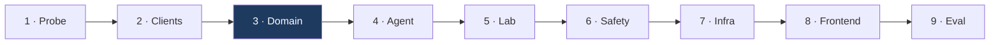

# Implementation plan

Build order is dependency order: each step is independently testable, and nothing
depends on something not yet built. Bottom-up — data access, then pure logic, then the
agent, then the file pipeline, then safety, then infrastructure, then the frontend —
so every layer can be verified before the next one sits on it.

This is not a release schedule. The whole scope in `architecture.md` §2 ships as one
system.

---

## Where the repository stands

| Done | Note |
|---|---|
| Legacy code removed | `services/`, `mcp_client/`, `orchestrator/`, `agents/`, old `tools/`, old `prompts/` |
| `agentcore.json` | Runtime `drugagent` deployed, ap-south-1, CodeZip, PYTHON_3_14 |
| `observability/` | OTel + CloudWatch, retained; content-logging not yet stripped |
| `config.py` | Base URLs, timeouts, retry policy, section names |
| `clients/base.py` | Shared async client, retry, typed errors |
| `pyproject.toml` | `httpx` + `tenacity` added, `requests` dropped |
| `clients/base.py` | Split into `_fetch` + `get_json` / `get_xml`; MedlinePlus is XML-only |
| `probes/` | Seven probes, 36 checks, all passing -- step 1 complete |
| Model selection | `apac.amazon.nova-lite-v1:0` (vision, cheapest, APAC-scoped) |
| Guardrails | Confirmed available in ap-south-1 |

Next line of code is step 2 below.

---

## Target layout

```
app/drugagent/
├── main.py                     entrypoint — thin, delegates everything
├── config.py                   settings, env vars, constants          [done]
├── model/
│   └── load.py                 Bedrock model configuration
├── clients/                    raw HTTP to external APIs
│   ├── base.py                 shared async client, retry, timeouts   [done]
│   ├── rxnorm.py               name normalisation
│   ├── rxclass.py              drug classes, ATC (D15)
│   ├── openfda.py              labels + adverse events
│   ├── dailymed.py             citation provenance
│   ├── pubchem.py              compounds + GHS hazard
│   ├── medlineplus.py          health topics + Connect
│   ├── clinicaltables.py       analyte text → LOINC
│   └── retrieval.py            interface — swap point for S3 Vectors (D2)
├── domain/                     pure logic — no I/O, no model, fully testable
│   ├── models.py               typed data structures
│   ├── brands.py               Indian brand → generic map (D14)
│   ├── severity.py             enum, tripwire, max-wins, escalation
│   ├── interactions.py         bidirectional cross-check
│   ├── triage.py               symptom red-flag ruleset
│   ├── labs.py                 analyte parsing, unit normalisation, comparison
│   └── units.py                unit conversion table
├── lab/                        file pipeline — I/O, not pure
│   ├── upload.py               presigned URL issue
│   └── extract.py              text layer, else vision
├── tools/                      Strands @tool — thin adapters over clients + domain
│   ├── normalize.py
│   ├── label_lookup.py
│   ├── interaction_check.py
│   ├── compound_lookup.py
│   ├── toxicity_lookup.py
│   ├── condition_lookup.py
│   ├── symptom_triage.py
│   └── lab_reference.py
├── prompts/
│   └── system.py
├── agent.py                    single agent assembly
├── observability/              content-logging removed
├── probes/                     live API verification scripts
└── tests/
```

**The `domain/` layer is the point.** Pure functions, no network, no model, no AWS.
Everything that must be guaranteed lives there and is tested without mocks or
credentials. Layers outside it are adapters.

---

## Step 1 — Verify every upstream before trusting it

A probe script per upstream, in `probes/`, with positive, negative and **nonsense**
controls. Run once, record the output in the repository, then write the client.

| Probe | Checks | Established |
|---|---|---|
| `probe_rxnorm.py` | 5 | `warfarin → 11289`; SCD hop (D4); typos need `approximateTerm` |
| `probe_openfda_label.py` | 7 | Control table reproduces; interaction section is 6,477 chars |
| `probe_openfda_event.py` | 4 | FAERS top terms are reporting artefacts; **no denominator field exists** |
| `probe_pubchem.py` | 5 | Name → CID; GHS lives in PUG-View; `CanonicalSMILES` was renamed |
| `probe_medlineplus.py` | 5 | XML only; titles carry `<span>` markup; unmapped LOINC returns nothing |
| `probe_rxclass.py` | 5 | ATC classes both directions; `relaSource` **must** be pinned |
| `probe_clinicaltables.py` | 5 | Analyte text → LOINC; `hemoglobin` is ambiguous across 508 items |

**Four upstreams, six conventions for "nothing found":**

| Upstream | "Not found" looks like |
|---|---|
| RxNorm | HTTP 200, `{"idGroup": {}}` |
| RxClass | HTTP 200, `{}` |
| openFDA | HTTP 404, `{"error": {"code": "NOT_FOUND"}}` |
| PubChem | HTTP 404, `{"Fault": {...}}` |
| MedlinePlus | HTTP 200, valid XML, `<count>0</count>` |
| Clinical Tables | HTTP 200, `[0, [], null, []]` |

`base.py` maps 404 → `None`, which covers two of the six. Every other client
checks for the **key**, never the status code. Code that branches on the status
treats "no such drug" as success and then reads a missing field.

The openFDA controls exist because `76/76` results were indistinguishable from an
ignored filter until nonsense terms proved the filter ran. Assume every new upstream
has the same trap until a nonsense control says otherwise.

**Status: complete.** 36/36 checks pass. Two probes changed the design rather than
confirming it -- Clinical Tables exists because tracing the lab flow end to end
revealed nothing mapped an analyte name to a LOINC code, and RxClass replaced a
hand-maintained class table (D15).

One probe failed on the first run and was right to. Its GHS-absent control used
water, assuming a harmless compound carries no hazard data; water has a full GHS
record. Replaced with hydrotalcite (CID 71749) -- a real antacid with a PUG-REST
record and a 404 on the hazard heading. The wrong assumption is recorded in the
file, because that is what the step is for.

---

## Step 2 — Clients

No agent, no model. Just: can we get the text?

| # | File | Contains |
|---|---|---|
| 1 | `config.py` | `SECTION_PRESETS` — how much label text each question type pays for ✓ |
| 2 | `clients/rxnorm.py` | `find_rxcui`, `approximate_match`, `get_related_products` (SCD hop) |
| 3 | `clients/rxclass.py` | `classes_for`, `members_of` — ATC only (D15) |
| 4 | `clients/openfda.py` | `search_by_name`, `get_sections`, `search_in_section`, `event_counts` |
| 5 | `clients/dailymed.py` | `get_spl` — setid, version, publish date for citations |
| 6 | `clients/pubchem.py` | `find_cid`, `get_properties`, `get_ghs` |
| 7 | `clients/medlineplus.py` | `search_topics` (XML), `lookup_loinc` (JSON) |
| 8 | `clients/clinicaltables.py` | `loinc_for`, `suggest_conditions` — scored, never auto-picked |
| 9 | `clients/retrieval.py` | Interface: `search(query) -> [Passage]` (D2 swap point) |

**Status: complete.** 38 tests pass -- 27 unit on mocked transport, 11 live smoke.

The split earns its keep. Unit tests prove the parsing is right against a fixed
response; they cannot notice an upstream changing shape, and every client here was
written against observed behaviour. The smoke tests caught what the unit tests could
not: `clients/rxnorm.get_name` had been written against a **guessed** URL --
`property.json?propName=RxNormName`, which reads more precisely than the real
`properties.json` and returns HTTP 400. It passed review and unit tests because the
mock answered the shape the code expected.

Step 1's rule was "nothing is written against a guessed URL". Step 2 broke it once.
`probe_rxnorm` now covers that endpoint.

Also settled here: `SECTION_PRESETS` (a section is included when its *absence* would
make the answer unsafe, not when its presence would make it richer) and D16 -- fuzzy
drug-name matches are confirmed by the user, because no threshold can separate
`prednisone → prednisolone` from `metfrmn → metformin`.

---

## Step 3 — Domain logic

Pure functions. No network. The heart of the system.

| # | File | Contains | Your call |
|---|---|---|---|
| 6 | `domain/models.py` | Typed vocabulary; `Severity`, `Analyte`, `InteractionResult`, `Citation` | ✓ |
| 7 | `domain/severity.py` | 9 tripwires, max-wins combination, escalation text | ✓ |
| 8 | `domain/interactions.py` | Bidirectional cross-check; class, ingredient and name matching | ✓ |
| 9 | `domain/triage.py` | 11-rule symptom red-flag ruleset | ✓ |
| 10 | `domain/units.py` | Unit normalisation; mass/molar conversion refused | ✓ |
| 11 | `domain/labs.py` | Row parsing, printed ranges, comparison, unparsed collection | ✓ |
| 12 | `domain/brands.py` | 45 Indian brands → US generic ingredients (D14) | ✓ |

**Clinical review required before real users**, on four things a clinician can read
directly because none of them is a prompt:

| Item | Where | Risk if wrong |
|---|---|---|
| Tripwire patterns | `severity.py` TRIPWIRES | A missed emergency presentation |
| Triage rules and thresholds | `triage.py` RULES | Same, with duration and combination |
| `CRITICAL_RANGE_MULTIPLE` | `labs.py` | A heuristic standing in for per-analyte critical values |
| Brand map, especially combinations | `brands.py` | Collapsing Combiflam to one ingredient halves an interaction check |

Escalation wording and the emergency number (`112`, India) also warrant a read.

**Status: complete.** 167 unit tests, no network, no model, no credentials, 0.35s.

Every exit criterion met:

- warfarin/aspirin → `documented: true`; metformin/aspirin → `documented: false`
- "sudden severe headache" → `EMERGENCY`; "headache for 3 days" → `LOW`
- a printed range flags correctly; a mismatched unit returns "could not be verified";
  an unparseable row appears in `unparsed`
- `max_severity()` is exhaustive over all 25 pairs, not a sample

Three defects this step found in itself:

| Defect | How it surfaced |
|---|---|
| `Severity` inherited **string** comparison from its `str` mixin, so `>` and `>=` answered alphabetically — `should_escalate()` would have refused to escalate an emergency | ordering test |
| `NOT_DOCUMENTED_MESSAGE` contained the word "safe" (in a negating clause, but still in front of a skimming reader) | vocabulary-ban test |
| `parse_row` could have dropped lines it did not understand | "every line lands somewhere" test |

The first is the one worth remembering. Four comparison operators are defined on
`Severity` and the comment explains why: defining only `__lt__`/`__le__` leaves `>`
falling back to `str`, where `"emergency" > "high"` is False. `functools.total_ordering`
does not help, because it only fills in operators the class does not already have and
`str` supplies all of them.

---

## Step 4 — Agent

| # | File | Contains |
|---|---|---|
| 12 | `tools/*.py` | Eight `@tool` adapters over clients + domain |
| 13 | `prompts/system.py` | Scope, grounding rules, citation format, severity instruction |
| 14 | `agent.py` | Single Strands agent, tool registration, structured output |
| 15 | `model/load.py` | Model id, inference config, prompt caching |

Tool docstrings are load-bearing — they are how the model decides what to call (D1).
Write them as an API contract for the model, not as notes for humans.

**Exit criterion:** `agentcore dev` answers flows 2–5 in `dataflow.md` locally, with
citations, and calls the right tool for each without a classifier.

---

## Step 5 — Lab pipeline

| # | File | Contains |
|---|---|---|
| 16 | `lab/upload.py` | Presigned PUT issue, key scoping, short expiry |
| 17 | `lab/extract.py` | Text-layer detection, direct extraction, vision fallback (D8) |
| 18 | `main.py` lab route | Extract → redact → parse → flag → delete |

**Exit criterion:** the same panel as a text PDF, a scanned PDF and a phone photo
produces the same analytes; the S3 object is gone after the response; nothing about the
report reaches any log.

---

## Step 6 — Safety and observability

| # | Change | Where |
|---|---|---|
| 19 | Tripwire → agent → max-wins gate wiring | `main.py` |
| 20 | Prompt text, analyte names and values removed from every log statement | `observability/*` |
| 21 | Response validator: citation present, FAERS caveat present | `agent.py` |
| 22 | Guardrails: PII/PHI filters, denied topics | `agentcore.json` |

`logger.info(f"Incoming request: {prompt}")` is deleted in step 20. It currently writes
health questions to CloudWatch.

**Exit criterion:** an emergency phrase escalates even when the model classifies it as
low; a FAERS-citing answer without the caveat is rejected; no content appears in any
log output.

---

## Step 7 — Infrastructure

| # | Change | Where |
|---|---|---|
| 23 | AgentCore Memory resource, TTL, strategy | `agentcore.json` |
| 24 | Memory wiring, `actorId` from an authenticated identity — blocked on 25 | `main.py` |
| 25 | Real auth in front of the API. A Cognito Hosted UI attempt did not work and was removed — see CLAUDE.md "Unauthenticated by design" for the diagnostic trail. Next attempt should budget for an AWS Support case, or consider IAM SigV4 / an API key instead | CDK |
| 26 | API Gateway (built, unauthenticated — `api.ts`) | CDK |
| 27 | S3 upload bucket: SSE-KMS, 1-day lifecycle, CORS, no public access | CDK |
| 28 | Dashboard + alarm on failed file deletion | `observability-dashboard.ts` |

**Exit criterion:** deployed; a follow-up question ("what's its dose?") resolves against
the previous turn; an uploaded object is provably gone.

---

## Step 8 — Frontend

| # | Item |
|---|---|
| 29 | Chat interface (built — vanilla JS, no framework, runs locally) |
| 30 | Streaming responses |
| 31 | File upload: PDF + photo, presigned PUT, progress |
| 32 | Citation rendering with source links (built) |
| 33 | Escalation block styling — visually distinct, not dismissible (built) |
| 34 | Lab result table: flag, value, range, range source, unparsed rows shown |
| 35 | Hosting, once step 25 lands real auth — S3 + CloudFront was tried and torn down alongside the Cognito attempt; re-evaluate hosting choice together with the auth choice |

**Exit criterion:** ask, get a cited answer; upload a report, get flags with their
reference source shown.

---

## Step 9 — Evaluation

| # | Item |
|---|---|
| 36 | Test set: known interactions, known non-interactions, red-flag symptoms, benign symptoms, toxicity, out-of-scope, lab fixtures |
| 37 | AgentCore evaluators: groundedness, citation validity, escalation recall |
| 38 | Online eval config on the deployed agent |

The metric that matters is **escalation recall** — of the cases that should have
escalated, how many did. A false escalation costs a user five minutes. A missed one
costs more than this project.

---

## Sequencing



Step 3 is highlighted because it carries the clinical correctness of the product.
Steps 1–3 are fully testable with no AWS account and no model calls — build and verify
them before spending anything.

---

## Testing

| Layer | Approach | Network | Model |
|---|---|---|---|
| `domain/` | Unit, fixture data | none | none |
| `clients/` | Mocked transport + a few live smoke tests | mixed | none |
| `lab/extract.py` | Fixture PDF + fixture photo, recorded vision output | none in CI | replayed |
| `tools/` | Integration, real clients | yes | none |
| `agent.py` | Scenario tests, recorded responses | yes | replayed |
| Safety gate | Unit, exhaustive over severity combinations | none | none |

The safety gate, the interaction cross-check, the triage ruleset and the lab comparison
get the most thorough coverage. Those are the four places where a bug is a clinical
problem rather than a bug.

---

## Cost discipline during development

Everything in steps 1–3 is free: NIH, FDA, PubChem and MedlinePlus APIs cost nothing,
and no model is called.

| Practice | Effect |
|---|---|
| Cheap model while building, capable model at release | Largest single lever |
| Prompt caching on system prompt + tool definitions | Identical every call |
| Record model responses once, replay in tests | CI costs nothing |
| Cap `max_tokens` | Bounds the worst case |
| Extract spans, never pass whole label sections | Two interaction sections ≈ 13k chars per query |
| Text-layer PDF path before vision (D8) | Most lab PDFs cost zero model tokens |
| No vector store (D2) | Avoids hundreds/month of idle capacity |

Context size is the real driver, not call count. A tool that returns 6,500 characters
when 400 would do multiplies every downstream cost for the life of the project.

---

## Open items

| Item | Needed by | Note |
|---|---|---|
| ~~Model availability~~ | — | **Resolved.** `apac.amazon.nova-lite-v1:0`. Most models here are INFERENCE_PROFILE only and reject the bare id; `apac.` keeps inference in-region, `global.` does not. |
| ~~Guardrails in ap-south-1~~ | — | **Resolved.** Available; two already exist in the account. |
| Indian brand alias map (D14) | Step 3 | Needs your org knowledge and a pharmacist's review. ~100-200 entries. |
| Nova Lite tool-routing across 8 tools | Step 9 | Its weakest area. One constant to swap if evaluation says so. |
| Vision model or Textract for the image path | Step 5 | Behind `extract()`; decide on measured accuracy against a real report |
| Memory strategy | Step 7 | `SUMMARIZATION` likely; `SEMANTIC` may retain more than intended |
| Auth approach | Step 7 | Cognito Hosted UI tried and removed — see CLAUDE.md. Next choice needed before step 25 |
| Frontend hosting | Step 8 | Decide together with auth — see step 35 |
| Clinical review of `triage.py` and critical values | Before real users | Not a technical sign-off |
| Organisational sign-off on accepting lab uploads | Before real users | PHI in the account is a policy decision |
