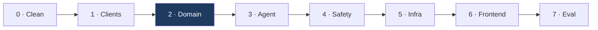

# Implementation plan — v1

Build order is deliberate: each step is independently testable, and nothing depends on
something not yet built. We build bottom-up — data access first, then the agent, then
safety, then infrastructure, then the frontend — so that every layer can be verified
before the next one sits on it.

---

## Target layout

```
app/drugagent/
├── main.py                     entrypoint — thin, delegates everything
├── config.py                   settings, env vars, constants
├── model/
│   └── load.py                 Bedrock model configuration
├── clients/                    raw HTTP to external APIs
│   ├── base.py                 shared async client, retry, timeouts
│   ├── rxnorm.py               name normalisation
│   └── openfda.py              label retrieval
├── domain/                     pure logic — no I/O, no model, fully testable
│   ├── models.py               typed data structures
│   ├── severity.py             enum, tripwire, escalation
│   └── interactions.py         cross-check algorithm
├── tools/                      Strands @tool — thin adapters over clients+domain
│   ├── normalize.py
│   ├── label_lookup.py
│   └── interaction_check.py
├── prompts/
│   └── system.py
├── agent.py                    single agent assembly
├── observability/              kept from existing code, content-logging removed
└── tests/
```

**The `domain/` layer is the point.** Pure functions, no network, no model, no AWS.
Everything that must be guaranteed lives there and is tested without mocks or
credentials. Layers outside it are adapters.

---

## Phase 0 — Clean slate

Removals (`git rm`, recoverable on the branch):

| Path | Reason |
|---|---|
| `app/drugagent/services/` | Never imported; deps never installed |
| `app/drugagent/mcp_client/` | Template leftover pointing at `mcp.exa.ai` |
| `app/drugagent/orchestrator/` | Replaced by single-agent design (D1) |
| `app/drugagent/agents/` | Three agents collapse to one |
| `app/drugagent/tools/` | Rewritten against openFDA |
| `app/drugagent/prompts/` | Rewritten for new scope |
| `**/__pycache__/` | Build artifacts |
| `agentcore/drugagent.zip` | Build output |
| `agentcore/drugagent/staging/` | Build output, incl. compiled `.so` |
| `.DS_Store`, `agentcore/.DS_Store` | Tracked; should be ignored |

Kept: `main.py` (rewritten in place), `model/`, `observability/`, all of `agentcore/`.

Also: extend `.gitignore` for build outputs and `.DS_Store`.

---

## Phase 1 — Data access

No agent, no model. Just: can we get the text?

| # | File | Contains | Verified by |
|---|---|---|---|
| 1 | `config.py` | Base URLs, timeouts, retry policy, section names | — |
| 2 | `clients/base.py` | `httpx.AsyncClient`, pooling, `tenacity` retry, error types | Unit, mocked transport |
| 3 | `clients/rxnorm.py` | `find_rxcui`, `get_related_products` (the SCD hop, D4) | Live call: warfarin → 11289 → 855288 |
| 4 | `clients/openfda.py` | `search_by_name`, `get_sections`, `search_in_section` | Live call: the control table in architecture §4 |

`pyproject.toml` gains `httpx` and `tenacity`, and drops `requests`.

**Exit criterion:** a script fetches warfarin's `drug_interactions` section and prints
6,000+ characters.

---

## Phase 2 — Domain logic

Pure functions. No network. The heart of the system.

| # | File | Contains | Verified by |
|---|---|---|---|
| 5 | `domain/models.py` | `DrugRef`, `LabelSection`, `InteractionResult`, `Severity`, `AgentResponse` | Type-level |
| 6 | `domain/severity.py` | Enum, emergency tripwire, escalation text, threshold rules | Unit — the tripwire needs real coverage |
| 7 | `domain/interactions.py` | Bidirectional cross-check, name + ingredient + class matching, `documented` contract | Unit, fixture label text |

**Exit criterion:** given two fixture label texts, the cross-check returns
`documented: true` for warfarin/aspirin and `documented: false` for
metformin/aspirin — with no network access in the test.

This is the phase where the project succeeds or fails. Everything else is plumbing.

---

## Phase 3 — Agent

| # | File | Contains |
|---|---|---|
| 8 | `tools/normalize.py` | `@tool` over `clients/rxnorm` |
| 9 | `tools/label_lookup.py` | `@tool` over `clients/openfda`, section selection |
| 10 | `tools/interaction_check.py` | `@tool` — concurrent fetch + `domain/interactions` |
| 11 | `prompts/system.py` | Scope, grounding rules, citation format, severity instruction |
| 12 | `agent.py` | Single Strands agent, tool registration, structured output |
| 13 | `model/load.py` | Current model id, inference config |

Tool docstrings are load-bearing — they are how the model decides what to call (D1).
Write them as an API contract for the model, not as notes for humans.

**Exit criterion:** `agentcore dev` answers all three flows in `docs/dataflow.md`
locally, with citations.

---

## Phase 4 — Safety and observability

| # | File | Contains |
|---|---|---|
| 14 | `main.py` | Rewritten entrypoint: tripwire → agent → gate → response |
| 15 | `observability/*` | Prompt text removed from every log statement |
| 16 | Guardrails config | PII/PHI filters, denied topics, in `agentcore.json` |

`logger.info(f"Incoming request: {prompt}")` is deleted in step 15. It currently
writes health questions to CloudWatch.

**Exit criterion:** an emergency phrase escalates even when the model classifies it as
low; no prompt text appears in any log output.

---

## Phase 5 — Infrastructure

| # | Change | Where |
|---|---|---|
| 17 | AgentCore Memory resource, TTL, strategies | `agentcore.json` |
| 18 | Memory load/write wiring, `actorId` = Cognito `sub` | `main.py` |
| 19 | Cognito user pool, org email domain restriction | CDK |
| 20 | API Gateway + JWT authorizer | CDK |
| 21 | Dashboard updated for new metric names | `observability-dashboard.ts` |

**Exit criterion:** deployed; a follow-up question ("what's its dose?") resolves
against the previous turn.

---

## Phase 6 — Frontend

| # | Item |
|---|---|
| 22 | React app, Cognito hosted UI or Amplify auth |
| 23 | Chat interface, streaming responses |
| 24 | Citation rendering with source links |
| 25 | Escalation block styling — visually distinct, not dismissible |
| 26 | Hosting: Amplify, or S3 + CloudFront |

**Exit criterion:** log in with an org email, ask, get a cited answer.

---

## Phase 7 — Evaluation

| # | Item |
|---|---|
| 27 | Test set: known interactions, known non-interactions, emergencies, out-of-scope |
| 28 | AgentCore evaluators for groundedness and citation validity |
| 29 | Online eval config on the deployed agent |

Focus: does every claim trace to retrieved text, and does escalation fire when it should.

---

## Sequencing



Phase 2 is highlighted because it carries the clinical correctness of the product.
Phases 1 and 2 are fully testable with no AWS account and no model calls — build and
verify them before spending anything.

---

## Testing

| Layer | Approach | Network |
|---|---|---|
| `domain/` | Unit, fixture data | none |
| `clients/` | Unit with mocked transport + a few live smoke tests | mixed |
| `tools/` | Integration, real clients | yes |
| `agent.py` | Scenario tests, recorded responses | yes |
| Safety gate | Unit, exhaustive over severity levels | none |

The safety gate and the interaction cross-check get the most thorough coverage. They
are the two places where a bug is a clinical problem rather than a bug.

---

## Open items

| Item | Needed by | Note |
|---|---|---|
| Model selection | Phase 3 | Current `claude-3-haiku-20240307` is old; confirm availability in `ap-south-1` |
| Guardrails availability | Phase 4 | Confirm Bedrock Guardrails in `ap-south-1` |
| Memory strategy choice | Phase 5 | `SUMMARIZATION` likely; `SEMANTIC` may retain too much |
| Org email domain | Phase 5 | Needed for the Cognito restriction |
| Frontend hosting | Phase 6 | Amplify vs S3 + CloudFront |
